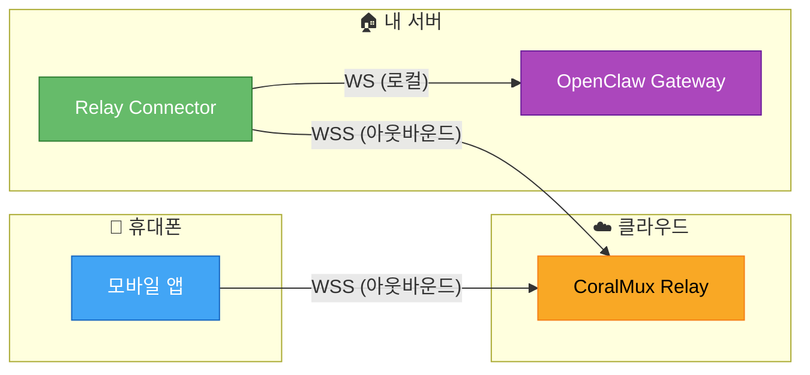
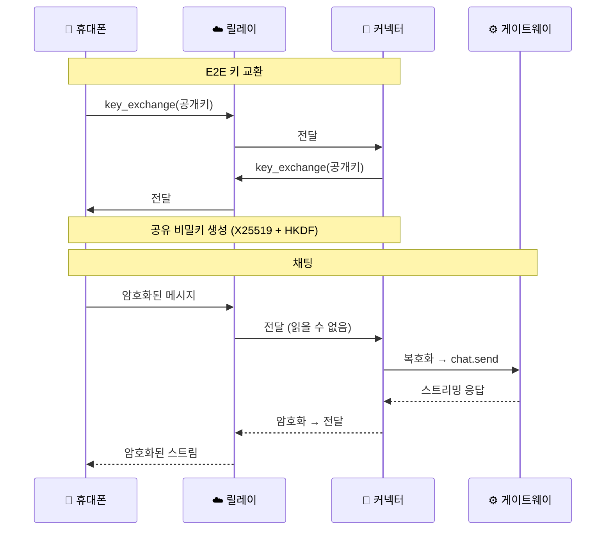

# OpenClaw Relay Connector

[🇺🇸 English](README.md)

[OpenClaw](https://github.com/openclaw/openclaw) 게이트웨이와 [CoralMux Relay](https://github.com/coralmux/relay)를 연결하는 Python 데몬입니다. 포트포워딩 없이 어디서든 AI 에이전트에 접속할 수 있습니다.

## 구조



양쪽 모두 **아웃바운드** WebSocket 연결을 사용합니다. NAT/방화벽 뒤에서도 동작합니다.

### 메시지 흐름



## 빠른 시작

### 설치

```bash
pip install openclaw-relay-connector
```

또는 소스에서:

```bash
git clone https://github.com/coralmux/agent.git
cd agent
pip install -e .
```

### 설정

```bash
openclaw-relay-connector init
# ~/.openclaw-agent/config.yaml 생성
```

`~/.openclaw-agent/config.yaml` 편집:

```yaml
relay:
  url: wss://relay.coralmux.com/ws
  token: oc_pair_여기에_토큰_입력

backend:
  type: openclaw
  openclaw:
    gateway_url: ws://localhost:18789
    token: 게이트웨이_토큰
```

### 실행

```bash
openclaw-relay-connector run
```

시스템 서비스로 등록:

```bash
# Linux (systemd)
sudo cp systemd/openclaw-relay-connector.service /etc/systemd/system/
sudo systemctl enable --now openclaw-relay-connector
```

## E2E 암호화

휴대폰과 커넥터 사이의 모든 메시지는 종단간 암호화됩니다. 릴레이 서버는 대화 내용을 **읽을 수 없습니다.**

- **키 교환:** X25519 ECDH
- **키 유도:** HKDF-SHA256
- **암호화:** AES-256-GCM
- 재접속 시 **키페어 재생성**

## 주요 기능

- 🔐 종단간 암호화 (X25519 + AES-256-GCM)
- 🔄 자동 재접속 (지수 백오프: 5초 → 최대 60초)
- ⚡ 실시간 스트리밍 (토큰 단위)
- 🖼️ 멀티모달 지원 (이미지 첨부)
- 🛑 안전한 종료 (SIGINT/SIGTERM)

## 요구사항

- Python 3.10+
- OpenClaw Gateway (로컬 실행 중)
- CoralMux Relay 페어링 토큰

## 관련 프로젝트

- [CoralMux Relay](https://github.com/coralmux/relay) — NAT 우회 릴레이 서버
- [OpenClaw](https://github.com/openclaw/openclaw) — AI 에이전트 게이트웨이

## 라이선스

MIT
