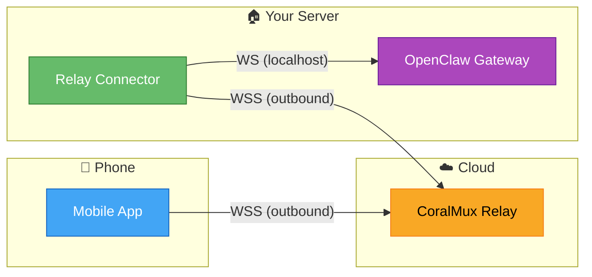
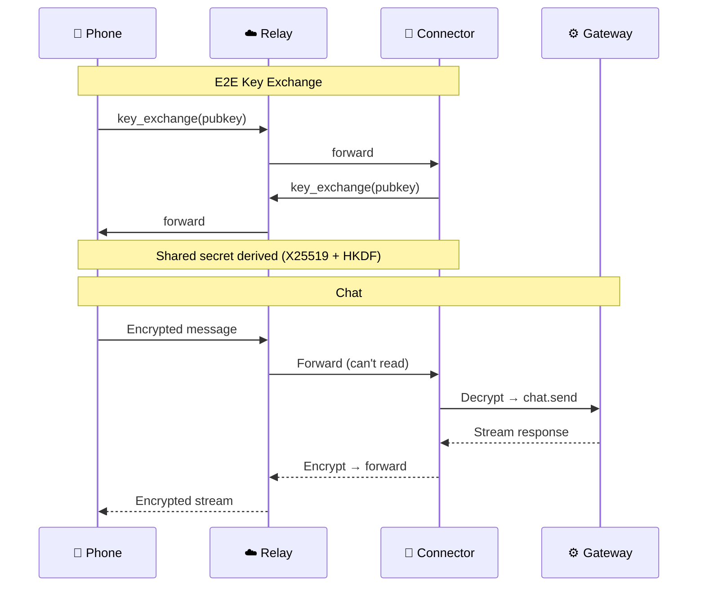

# OpenClaw Relay Connector

[🇰🇷 한국어](README.ko.md)

Python daemon that bridges [OpenClaw](https://github.com/openclaw/openclaw) Gateway to [CoralMux Relay](https://github.com/coralmux/relay). Run it on your home server, laptop, or any machine with internet access — no port forwarding needed.

## Architecture



Both sides make **outbound** WebSocket connections. Works behind any NAT/firewall.

### Message Flow



## Quick Start

### Install

```bash
pip install openclaw-relay-connector
```

Or from source:

```bash
git clone https://github.com/coralmux/openclaw-relay-connector.git
cd openclaw-relay-connector
pip install -e .
```

### Configure

```bash
openclaw-relay-connector init
# Creates ~/.openclaw-agent/config.yaml
```

Edit `~/.openclaw-agent/config.yaml`:

```yaml
relay:
  url: wss://relay.coralmux.com/ws
  token: oc_pair_YOUR_TOKEN_HERE

backend:
  type: openclaw
  openclaw:
    gateway_url: ws://localhost:18789
    token: YOUR_GATEWAY_TOKEN
```

### Run

```bash
openclaw-relay-connector run
```

### Run as Service (auto-start on boot)

**macOS (launchd):**

```bash
cat > ~/Library/LaunchAgents/com.coralmux.relay-connector.plist << 'EOF'
<?xml version="1.0" encoding="UTF-8"?>
<!DOCTYPE plist PUBLIC "-//Apple//DTD PLIST 1.0//EN" "http://www.apple.com/DTDs/PropertyList-1.0.dtd">
<plist version="1.0">
<dict>
    <key>Label</key>
    <string>com.coralmux.relay-connector</string>
    <key>ProgramArguments</key>
    <array>
        <string>/path/to/venv/bin/openclaw-relay-connector</string>
        <string>run</string>
    </array>
    <key>RunAtLoad</key>
    <true/>
    <key>KeepAlive</key>
    <true/>
    <key>StandardOutPath</key>
    <string>/tmp/openclaw-agent.log</string>
    <key>StandardErrorPath</key>
    <string>/tmp/openclaw-agent.log</string>
</dict>
</plist>
EOF

launchctl load ~/Library/LaunchAgents/com.coralmux.relay-connector.plist
```

**Linux (systemd):**

```bash
sudo cp systemd/openclaw-relay-connector.service /etc/systemd/system/
sudo systemctl enable --now openclaw-relay-connector
```

## E2E Encryption

All messages are encrypted end-to-end between phone and connector. The relay server **cannot** read your conversations.

- **Key Exchange:** X25519 ECDH
- **Key Derivation:** HKDF-SHA256
- **Encryption:** AES-256-GCM
- **Keypair regenerated** on each reconnection

## Features

- 🔐 End-to-end encryption (X25519 + AES-256-GCM)
- 🔄 Auto-reconnect with exponential backoff (5s → 60s)
- ⚡ Real-time streaming (token-by-token)
- 🖼️ Multimodal support (image attachments)
- 🛑 Graceful shutdown (SIGINT/SIGTERM)

## Requirements

- Python 3.10+
- OpenClaw Gateway running locally
- Pairing token from CoralMux Relay

## Related Projects

- [CoralMux Relay](https://github.com/coralmux/relay) — NAT-transparent relay server
- [OpenClaw](https://github.com/openclaw/openclaw) — AI agent gateway

## License

MIT
